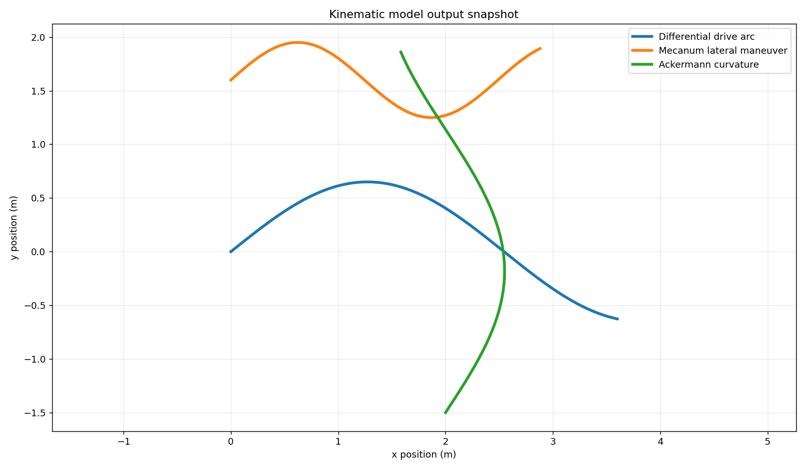

# cpp-mobile-robot-kinematics

A compact modern C++ library for common planar mobile robot kinematics. The
project keeps the math explicit, dependency-free, and easy to embed in robot
control loops, simulation glue, or teaching examples.

## Models

- Differential drive forward and inverse kinematics
- Mecanum drive forward and inverse kinematics
- Ackermann steering curvature and body twist conversion
- SE(2) pose integration from body-frame twists

## Layout

```text
include/cpp_mobile_robot_kinematics/  Public headers
src/                                    Library implementation
examples/                               Small runnable demos
tests/                                  No-dependency test executable
docs/                                   Model notes and equations
```

## Build

```bash
cmake -S . -B build
cmake --build build
ctest --test-dir build
```

Disable examples or tests when embedding the library:

```bash
cmake -S . -B build -DCMRK_BUILD_EXAMPLES=OFF -DCMRK_BUILD_TESTS=OFF
```

## Quick Example

```cpp
#include <cpp_mobile_robot_kinematics/differential_drive.hpp>

namespace cmrk = cpp_mobile_robot_kinematics;

int main() {
  cmrk::DifferentialDriveKinematics drive({0.075, 0.42});
  cmrk::Twist2D command{0.6, 0.0, 0.8};
  cmrk::WheelSpeeds wheel_speeds = drive.inverse(command);
  cmrk::Pose2D next_pose = drive.integrate({0.0, 0.0, 0.0}, wheel_speeds, 0.02);
}
```

## Units and Frames

- Distances are meters.
- Angles are radians.
- Wheel speeds are radians per second.
- Body-frame `x` points forward, `y` points left, and positive yaw is
  counter-clockwise.

## License

MIT

## Kinematics output



Kinematic trajectory snapshot for differential, mecanum, and Ackermann-style motion.


## Model implementation

- Modern C++ implementations of common planar mobile-robot kinematics.
- Explicit units, frames, and pose integration suitable for control or simulation glue.
- A small library layout with examples and dependency-free tests.


## Validation notes

- The models are kinematic and do not include dynamics, slip, or actuator saturation.
- The examples are numerical demonstrations rather than ROS controllers.
- Next steps: add ROS 2 adapter examples and compare against simulated vehicle traces.

